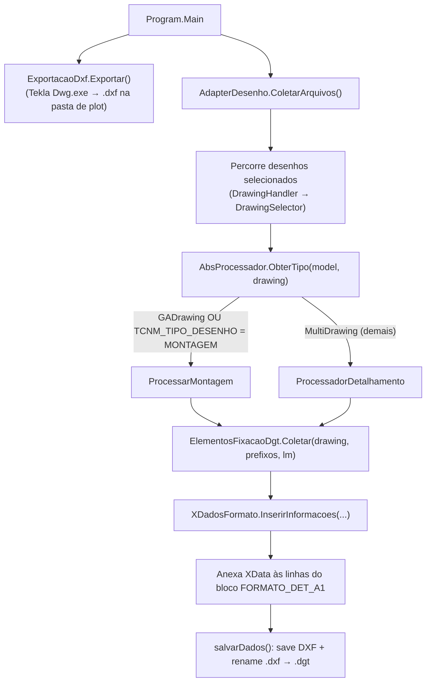
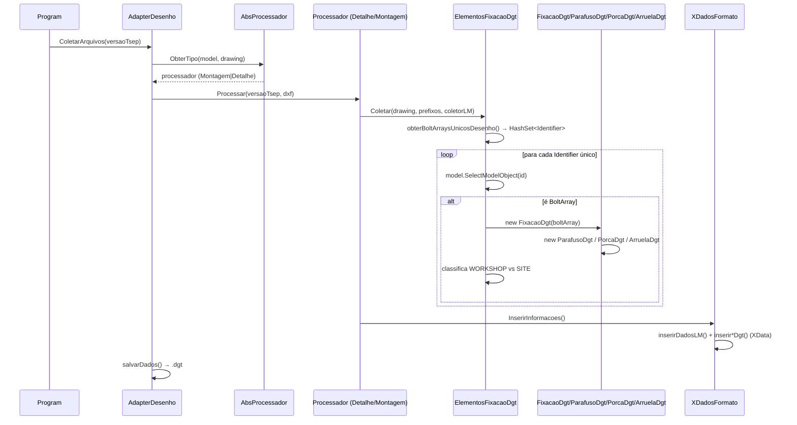
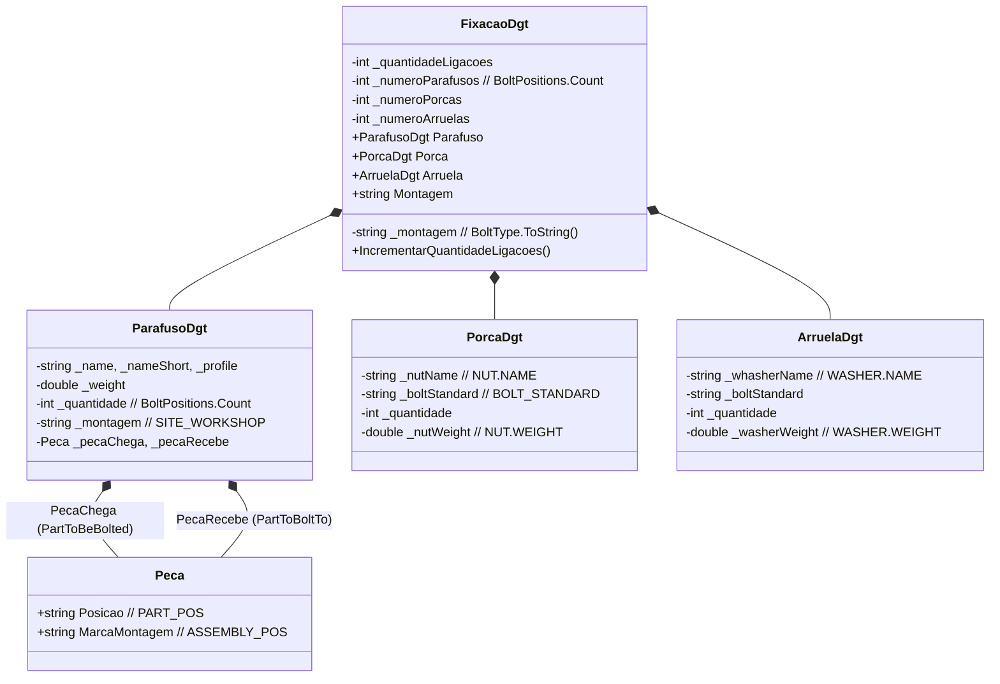
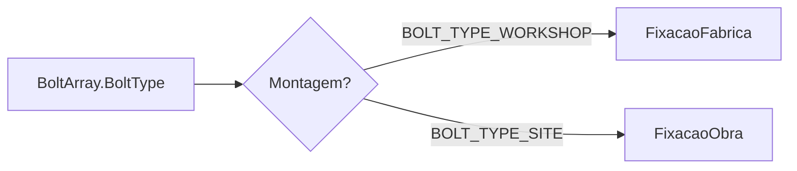
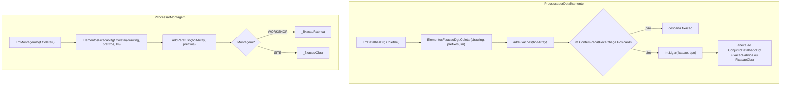
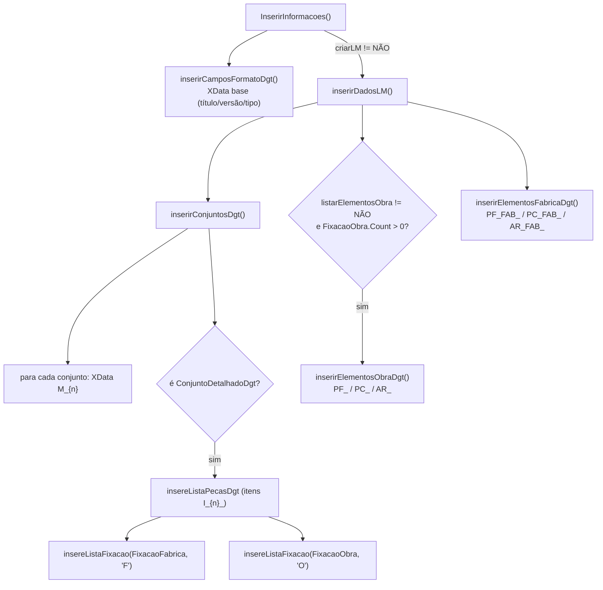
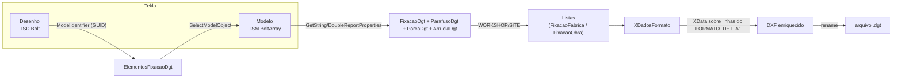

# Relatório — Fluxo lógico da extração de parafusos do Tekla e inclusão no DGT

> **Projeto:** `TNKDxf` (solução `TNKDxf.sln`)
> **Escopo:** entender como os parafusos (e porcas/arruelas) são lidos do modelo/desenho Tekla e gravados no ficheiro `.dgt`.
> **Base:** inspeção do código-fonte em `ConsoleTNKDxf` (fluxo atual) e `TNKDxf` (aplicação WPF, sem tratamento de parafusos).

---

## 1. Conceito essencial: o que é o "DGT" aqui

O `.dgt` **não é** um formato binário proprietário no código. Ele é, na prática:

1. Um **DXF** que o Tekla já plotou (exportado via `Dwg.exe` → pasta de plot).
2. Esse DXF é **aberto** (`DxfDocument.Load`), e nele são **anexados XData** (extended entity data) do AutoCad/DXF sobre linhas de referência do bloco de formato.
3. O DXF é **salvo e renomeado** de `.dxf` para `.dgt`.

Ou seja, **o "DGT" é um DXF enriquecido com XData** que transporta a lista de materiais e as fixações (parafusos/porcas/arruelas). A chave de aplicação (APPNAME) usada é `08478f494deb`.

```
Tekla (modelo + desenho)
      │  exporta DXF (plot)
      ▼
arquivo .dxf (formato FORMATO_DET_A1)
      │  DxfDocument.Load + XData anexado
      ▼
arquivo .dxf "enriquecido"
      │  rename .dxf → .dgt
      ▼
arquivo .dgt
```

---

## 2. Mapa dos ficheiros relevantes

| Ficheiro | Papel |
|---|---|
| `ConsoleTNKDxf/Program.cs` | Ponto de entrada; conecta ao modelo e chama a exportação. |
| `ConsoleTNKDxf/ExportacaoDxf.cs` | Dispara o export DXF do Tekla (`Dwg.exe`). |
| `ConsoleTNKDxf/AdapterDesenho.cs` | Orquestra o processamento de cada desenho selecionado. |
| `ConsoleTNKDxf/Dgts/ProcessoTekla/AbsProcessador.cs` | Fábrica que decide o tipo de desenho (montagem vs. detalhe). |
| `ConsoleTNKDxf/Dgts/ProcessoTekla/ProcessadorDetalhamento.cs` | Processa desenhos de detalhe (parte). |
| `ConsoleTNKDxf/Dgts/ProcessoTekla/ProcessarMontagem.cs` | Processa desenhos de montagem (GA). |
| `ConsoleTNKDxf/Dgts/ElementosFixacaoDgt.cs` | **Núcleo da extração de parafusos** (desenho → `BoltArray`). |
| `ConsoleTNKDxf/Dgts/FixacaoDgt.cs` | Agrega parafuso + porca + arruela de um `BoltArray`. |
| `ConsoleTNKDxf/Dgts/ParafusoDgt.cs` | Lê os atributos do parafuso do `BoltArray`. |
| `ConsoleTNKDxf/Dgts/PorcaDgt.cs` | Lê os atributos da porca do `BoltArray`. |
| `ConsoleTNKDxf/Dgts/ArruelaDgt.cs` | Lê os atributos da arruela do `BoltArray`. |
| `ConsoleTNKDxf/Dgts/LmDetalhesDtg.cs` | Coletor da lista de materiais de detalhe + `Ligar(...)` fixações ao conjunto. |
| `ConsoleTNKDxf/Dgts/LmMontagemDgt.cs` | Coletor da lista de materiais de montagem. |
| `ConsoleTNKDxf/Dgts/LmAbs.cs` | Base abstrata dos coletores de LM. |
| `ConsoleTNKDxf/Dgts/ConjuntoDetalhadoDgt.cs` / `ConjuntoMontagemDgt.cs` | Representam um conjunto/marca na LM. |
| `ConsoleTNKDxf/Abstracoes/ConjuntoAbstrato.cs` | Base dos conjuntos; guarda `FixacaoFabrica`/`FixacaoObra`. |
| `ConsoleTNKDxf/Dgts/CamposDesenhoINP.cs` | Lê os campos de título do desenho (TITLE, TITLE1…). |
| `ConsoleTNKDxf/XDadosFormato.cs` | **Núcleo da escrita no DGT** (grava XData). |
| `ConsoleTNKDxf/Peca.cs` | Modelo interno de peça (PART_POS, ASSEMBLY_POS, FINISH). |
| `ConsoleTNKDxf/Extensoes.cs` | Helpers (`ObterPropriedade`, `ConverterParaDouble`, `TeklaSubstring`). |

### Fluxo "legado" (não usado no caminho DGT atual)
| Ficheiro | Papel |
|---|---|
| `ConsoleTNKDxf/ElementosFixacao.cs` | Versão antiga da coleta (gera `Parafuso`/`Porca`/`Arruela`). |
| `ConsoleTNKDxf/Parafuso.cs`, `Porca.cs`, `Arruela.cs` | Modelos legados (implementam `ILinhaLM`). |
| `ConsoleTNKDxf/DescricaoParafuso.cs`, `DescricaoPorca.cs`, `DescricaoArruela.cs` | Descrições legadas com regras de texto. |
| `ConsoleTNKDxf/MaterialPorca.cs`, `MaterialArruela.cs` | Materiais legados por `BOLT_STANDARD`. |
| `ConsoleTNKDxf/Desenho.cs`, `ListaMateriais.cs`, `Conjunto.cs` | Caminho antigo de coleta (lista de materiais + fixações). |

---

## 3. Visão geral do fluxo de ponta a ponta



### Diagrama de sequência (resumo)



---

## 4. Extração dos parafusos (o coração do fluxo)

### 4.1 Como o parafuso é localizado no desenho

O objeto no **desenho** é um `TSD.Bolt` (`Tekla.Structures.Drawing.Bolt`). O código não lê os atributos desse objeto gráfico; ele usa apenas o seu **`ModelIdentifier`** (GUID) para chegar ao objeto do **modelo**, que é o `TSM.BoltArray` (`Tekla.Structures.Model.BoltArray`).

```
view (TSD.View)
  └─ GetObjects(typeof(TSD.Bolt))
       └─ TSD.Bolt.ModelIdentifier  ──(HashSet dedup)──▶  _model.SelectModelObject(id)
                                                             └─ TSM.BoltArray
```

```csharp
// ElementosFixacaoDgt.obterBoltArraysUnicosDesenho()
var views = multiDrawing.GetSheet().GetAllViews().GetEnumerator();
while (views.MoveNext())
{
    var view = views.Current as TSD.View;
    DrawingObjectEnumerator drawingBolts = view.GetObjects(new[] { typeof(TSD.Bolt) });
    while (drawingBolts.MoveNext())
    {
        TSD.Bolt drwBolt = drawingBolts.Current as TSD.Bolt;
        boltArraysUnicosDesenho.Add(drwBolt.ModelIdentifier); // HashSet → deduplica por GUID
    }
}
```

**Por que `HashSet<Identifier>`?** Para garantir que cada `BoltArray` seja contado uma única vez, mesmo que o mesmo parafuso apareça em várias vistas (frontal, topo, etc.).

### 4.2 Do `Identifier` ao `BoltArray`

```csharp
foreach (Identifier modelId in boltArraysUnicosDesenho)
{
    var modelObj = _model.SelectModelObject(modelId);
    if (modelObj is TSM.BoltArray modelBoltArray)
    {
        addFixacoes(modelBoltArray);        // caminho de DETALHE
        // ou addParafuso(modelBoltArray, ...) // caminho de MONTAGEM
    }
}
```

### 4.3 Montagem do objeto `FixacaoDgt`

Para cada `BoltArray` é criado um `FixacaoDgt`, que agrega:



```csharp
// FixacaoDgt(FixacaoDgt.cs)
_montagem          = boltArray.BoltType.ToString();   // BOLT_TYPE_WORKSHOP | BOLT_TYPE_SITE
_numeroParafusos   = boltArray.BoltPositions.Count;
_parafuso          = new ParafusoDgt(boltArray, boltArray.PartToBeBolted);
incluirPorcasArruelas(boltArray);
_numeroArruelas    = _numeroArruelas * _numeroParafusos;
_numeroPorcas      = _numeroPorcas   * _numeroParafusos;
```

A leitura dos atributos é sempre feita por **propriedades de relatório do Tekla** (`GetStringReportProperties`, `GetDoubleReportProperties`), e não por propriedades diretas da API.

### 4.4 Atributos lidos de cada `BoltArray`

| Componente | Propriedade de relatório | Usada como |
|---|---|---|
| **Parafuso** | `NAME` | identificação/posição (primeiros 4 chars na versão legada) |
| | `NAME_SHORT` | material/descrição curta |
| | `PROFILE` | perfil/descrição |
| | `SITE_WORKSHOP` | classificação obra/fábrica (string) |
| | `WEIGHT` | peso unitário |
| | `BoltPositions.Count` | quantidade de parafusos do grupo |
| **Porca** | `NUT.NAME` | identificação da porca |
| | `BOLT_STANDARD` | norma do parafuso |
| | `NUT.WEIGHT` | peso da porca |
| | `BoltPositions.Count` | quantidade |
| **Arruela** | `WASHER.NAME` | identificação da arruela |
| | `BOLT_STANDARD` | norma do parafuso |
| | `WASHER.WEIGHT` | peso da arruela |
| | `BoltPositions.Count` | quantidade |

**Peças ligadas pelo parafuso** (via `ParafusoDgt`):
- `PecaChega` = `boltArray.PartToBeBolted` (peça principal que recebe o furo/parafuso).
- `PecaRecebe` = `boltArray.PartToBoltTo` (peça aparafusada).
- `Peca` lê `PART_POS` → `Posicao` e `ASSEMBLY_POS` → `MarcaMontagem`.

**Porcas e arruelas presentes** (flags do `BoltArray`):
```csharp
if (boltArray.Nut1) processarPorca(boltArray);
if (boltArray.Nut2) processarPorca(boltArray);
if (boltArray.Washer1) processarArruela(boltArray);
if (boltArray.Washer2) processarArruela(boltArray);
if (boltArray.Washer3) processarArruela(boltArray);
```

### 4.5 Classificação: fábrica (workshop) vs. obra (site)

Há **duas** grandezas distintas com nomes parecidos — atenção:

| Campo | Origem | Valores |
|---|---|---|
| `FixacaoDgt.Montagem` | `boltArray.BoltType.ToString()` | `BOLT_TYPE_WORKSHOP` / `BOLT_TYPE_SITE` |
| `ParafusoDgt.Montagem` | propriedade `SITE_WORKSHOP` | string do template (ex.: "Site"/"Workshop") |

A **classificação para as listas** usa `FixacaoDgt.Montagem` (o `BoltType`):



### 4.6 Dois caminhos de coleta (detalhe vs. montagem)



**Detalhe (parte):** a fixação só é aceite se a peça "chega" pertencer a um conjunto já coletado na lista de materiais (`lm.ContemPeca`), e depois é **ligada** ao conjunto certo via `lm.Ligar(...)`, usando `fixacao.Parafuso.PecaChega.MarcaMontagem` (= `ASSEMBLY_POS`) para achar o `ConjuntoDetalhadoDgt`.

**Montagem (GA):** as fixações não são ligadas a um conjunto específico; vão para listas globais `_fixacaoFabrica` / `_fixacaoObra`.

---

## 5. Escrita no DGT (`XDadosFormato`)

### 5.1 Onde os dados são gravados

O código localiza o bloco de formato `FORMATO_DET_A1` e usa as suas **linhas** como âncora para o XData:

```csharp
var blocoLista = _dxf.Entities.Inserts.FirstOrDefault(x => x.Block.Name.StartsWith("FORMATO_DET_A1"));
var linhasHorizontais = blocoLista.Block.Entities.OfType<Line>().Where(l => l.StartPoint.Y == l.EndPoint.Y).ToList();
var linhasVerticais   = blocoLista.Block.Entities.OfType<Line>().Where(l => l.StartPoint.X == l.EndPoint.X).ToList();

linhaHorizontalMaisAlta   = linhasHorizontais.OrderByDescending(l => l.StartPoint.Y).First(); // campos de título
linhaVerticalMaisDireita  = linhasVerticais.OrderByDescending(l => l.StartPoint.X).First();   // lista de materiais
linhaHorizontalMaisBaixa  = linhasHorizontais.OrderBy(l => l.StartPoint.Y).First();           // quadro de aplicação
```

### 5.2 Estrutura do XData (chaves / ApplicationRegistry)

APPNAME base = `08478f494deb`.

| Prefixo | Conteúdo |
|---|---|
| `08478f494deb` | Campos de formato (título, projeto, escalas, versão TSEP, tipo de desenho). |
| `08478f494deb_M_{n}` | Cada conjunto/marca da lista de materiais. |
| `08478f494deb_I_{n}_` | Peças (itens) do conjunto `n`. |
| `08478f494deb_I_{n}_PF{F\|O}_` | Parafusos ligados ao conjunto `n` (F= fábrica, O= obra). |
| `08478f494deb_I_{n}_PC{F\|O}_` | Porcas ligadas ao conjunto `n`. |
| `08478f494deb_I_{n}_AR{F\|O}_` | Arruelas ligadas ao conjunto `n`. |
| `08478f494deb_PF_{n}_` / `_PC_` / `_AR_` | Lista global de elementos de **obra**. |
| `08478f494deb_PF_FAB_{n}_` / `_PC_FAB_` / `_AR_FAB_` | Lista global de elementos de **fábrica**. |
| `08478f494deb_QA` | Quadro de aplicação (tag, quantidade, desenho, família). |

### 5.3 Fluxo de escrita



### 5.4 Campos gravados por componente (XDataRecord, todos `String`)

**Parafuso — lista global** (`inserirParafusosDgt`):
`NAME`, `Quantidade`, `NAME_SHORT`, `WEIGHT`

**Parafuso — lista ligada ao conjunto** (`insereParafusoFabricaDgt`):
`NAME`, `Quantidade`, `NAME_SHORT`, `WEIGHT`, `PROFILE`, `PecaChega.Posicao`, `PecaRecebe.Posicao`, `Montagem`

**Porca** (`inserirPorcasDgt` / `inserePorcaFabricaDgt`):
`NUT.NAME`, `Quantidade`, `BOLT_STANDARD`, `NUT.WEIGHT`
(a versão ligada ao conjunto usa a ordem `NUT.NAME`, `BOLT_STANDARD`, `Quantidade`, `NUT.WEIGHT`)

**Arruela** (`inserirArruelasDgt` / `insereArruelaFabricaDgt`):
`WASHER.NAME`, `Quantidade`, `BOLT_STANDARD`, `WASHER.WEIGHT`
(a versão ligada usa `WASHER.NAME`, `BOLT_STANDARD`, `Quantidade`, `WASHER.WEIGHT`)

---

## 6. Gravação final do ficheiro `.dgt`

```csharp
// AdapterDesenho.salvarDados(...)
var caminhoSalvar = nomeArquivoProcessado.Replace(nome, $"Enviar\\{nome}");
dxf.Save(caminhoSalvar, true);                 // salva o DXF enriquecido

var caminhoSalvarR3D = caminhoSalvar.Replace(".dxf", ".dgt");
if (File.Exists(caminhoSalvarR3D)) File.Delete(caminhoSalvarR3D);
File.Move(caminhoSalvar, caminhoSalvarR3D);    // .dxf → .dgt
File.Delete(caminhoSalvar);
File.Delete(nomeArquivoProcessado);            // remove o DXF original da pasta de plot
```

```
pasta de plot (XS_DRAWING_PLOT_FILE_DIRECTORY)
   └─ desenho.dxf   ──▶  Enviar/desenho.dxf  ──▶  Enviar/desenho.dgt
```

---

## 7. Diagrama-resumo do fluxo de dados



---

## 8. Observações e pontos de atenção (caveats)

1. **Identificação pelo desenho, dados do modelo.** O `TSD.Bolt` do desenho só fornece o `ModelIdentifier`; toda a informação real (NAME, WEIGHT, porcas, arruelas, peças) vem do `TSM.BoltArray` do modelo. Por isso, o parafuso precisa existir no modelo para ser extraído.

2. **`BoltPositions.Count` define a quantidade.** A "quantidade" de parafusos/porcas/arruelas é o número de posições do grupo (`BoltArray.BoltPositions.Count`), não um contador de ocorrências no desenho.

3. **Colapso de porcas/arruelas múltiplas.** `FixacaoDgt` guarda **uma única** `PorcaDgt` e **uma única** `ArruelaDgt`. Se o `BoltArray` tiver `Nut1` e `Nut2` (ou `Washer1`/`Washer2`/`Washer3`), o segundo `processarPorca`/`processarArruela` sobrescreve o objeto anterior. Os contadores `_numeroPorcas`/`_numeroArruelas` são calculados mas **não** são expostos nem gravados no XData final.

4. **Dois significados de "montagem".** `FixacaoDgt.Montagem` vem de `BoltType` (WORKSHOP/SITE) e é o que classifica as listas; `ParafusoDgt.Montagem` vem de `SITE_WORKSHOP` (template) e é o que efetivamente vai para o XData do parafuso. Não confundir.

5. **Classificação por `BoltType`.** No caminho de detalhe (`addFixacoes`) a comparação é `== "BOLT_TYPE_WORKSHOP"` e `== "BOLT_TYPE_SITE"`; qualquer outro valor simplesmente não é ligado (fica sem destino). No caminho de montagem (`addParafuso`), tudo o que não é WORKSHOP cai em `_fixacaoObra`.

6. **Filtro de peça no detalhe.** Em `addFixacoes`, se `lm.ContemPeca(fixacao.Parafuso.PecaChega.Posicao)` for falso, a fixação é descartada. Isso garante que só se listam parafusos de peças efetivamente presentes na LM do desenho de detalhe.

7. **`Equals` por referência.** `FixacaoDgt` não sobrescreve `Equals`; `Contains`/`FirstOrDefault(...Equals...)` em `Ligar`/`ligar` usam igualdade de referência. Portanto, fixações "iguais" (mesmo parafuso) em `BoltArray`s diferentes **não** são agregadas — a deduplicação só ocorre a nível do `Identifier` (GUID) do desenho.

8. **Código legado ainda presente.** `ElementosFixacao.cs`, `Parafuso.cs`, `Porca.cs`, `Arruela.cs`, `DescricaoParafuso.cs` etc. formam um caminho mais antigo (com descrições formatadas como "PARAF SEXT …", "PORCA SEXT …", "ARRUELA LISA …" e regras de material por `BOLT_STANDARD`). Esse caminho **não** é chamado pelo fluxo DGT atual (`Program.cs` → `AdapterDesenho` → `AbsProcessador`), mas permanece no projeto.

9. **Tipo de desenho decide o processador.** `AbsProcessador.ObterTipo` usa reflexão para obter o `Identifier` do desenho, cria um `Beam` temporário com esse ID e lê `TCNM_TIPO_DESENHO`. `GADrawing` → montagem; `MultiDrawing` com `TCNM_TIPO_DESENHO == "MONTAGEM"` → montagem; demais `MultiDrawing` → detalhe.

10. **Flags de controle via template.** `TCNM_CRIAR_LM` e `TCNM_LISTAR_PARAF` controlam se a lista de materiais e a lista de elementos de obra são gravadas no XData (valores comparados a "NÃO").

---

## 9. Resumo em uma frase

> O programa percorre as vistas de cada desenho selecionado, localiza os objetos gráficos `TSD.Bolt`, resolve cada um para o `TSM.BoltArray` do modelo via `ModelIdentifier`, lê os atributos de relatório (parafuso/porca/arruela + peças ligadas), classifica a fixação como fábrica ou obra, e grava tudo como **XData** anexado às linhas do bloco de formato do DXF — que por fim é salvo e renomeado para `.dgt`.
